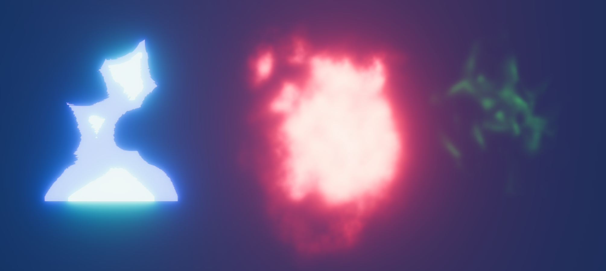

# Unity Shader Graph Workshop

This repository contains the Unity project and workshop slides for a three part series on Unity Shader Graph.

## Introduction 
The workshop contains three parts:
* Creating a RIME inspired stylized fire based on the presentation by Simon Trümpler ([link](https://www.unrealengine.com/en-US/events/unreal-fest-europe-2018/stylized-vfx-in-rime)).
* Creating a two-texture shader inspired by Julian Love's GDC presentation on the VFX of Diablo ([link](https://www.youtube.com/watch?v=YPy2hytwDLM)).
* Adjusting the shaders for use in particle systems. 

The project uses Unity 2020.3.0f1 with the Universal Render Pipeline. The `Starter` scene is the intended entry point and only contains a camera, directional light, and minimal post-processing (Bloom and Tonemapping).

Some familiarity with Unity is expected, specifically basic knowledge of Materials, creating objects, interface navigation, and a minimal Shader Graph introduction. This is mainly because I do not show every step in the presentation slides.

## Organization 
The root repo is a Unity project that can be directly opened.
The three presentations are `SGWorkshop1.pdf`, `SGWorkshop2.pdf`, and `SGWorkshop3.pdf`, corresponding to each of the three parts.
Within the project itself, there are multiple noise and RGBA textures for use in the shaders.
I have also included two custom models created specifically for the workshop, a pillar and sconce, for use in creating a test scene.

***Completed Materials***  
The `Finished` folders in `Shaders` and `Materials` contain the completed versions of the shaders created throughout the workshop.
In addition, the `Main` and `Test` scenes show the usage of the shaders.
